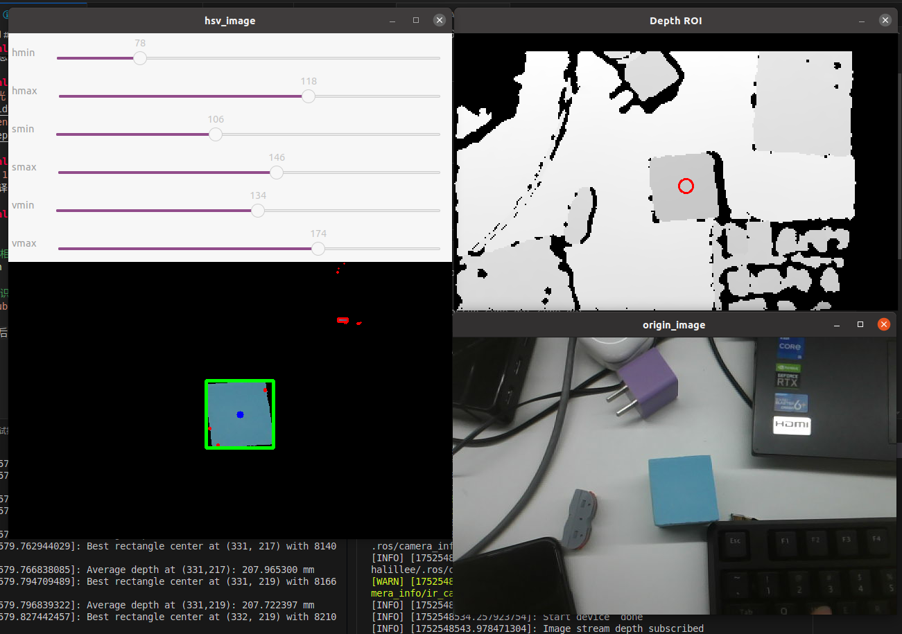

## <div align="center">简单色块识别及其三维坐标提取</div>      
一个简单的色块识别及其三维坐标提取的程序，使用OpenCV库，通过深度相机的深度信息与色彩信息进行识别，识别出的色块的三维坐标可以用于简单的机械臂抓取任务。

## <div align="center">硬件设备</div>
- [奥比中光 Petrel](https://orbbec.com.cn/index/Product/info.html?cate=38&id=28) 带对齐的深度图像与RGB图像：640*400@30fps
- [RealSense D435](https://realsenseai.com/stereo-depth-cameras/stereo-depth-camera-d435/)  带对齐的深度图像与RGB图像：640*480@30fps

## <div align="center">软件依赖</div>
- [pcl-1.10](https://github.com/PointCloudLibrary/pcl)  单独编译时需要指定编译on_nurbs选项

## <div align="center">运行</div>

````bash
# 首先启动相机驱动节点,以奥比中光Petrel为例
roslaunch astra_camera dabai_dc1.launch

# 启动色块识别节点
rosrun cube_det cube_det
````
运行后出现三个OpenCV的图像窗口，其中用鼠标在origin_img图片上点击进行色块的选择，随后深度图会自动计算色块的平均深度并返回到方框中心坐标上，例如下图先在origin_img图片上点击青蓝色方块的位置，则其他两张图会自动找到色块位置并可视化

然后点击再次在origin_img窗口点击紫色方块的位置，其他两张图会自动找到色块位置并可视化


## <div align="center">单色曲线的三维坐标提取与拟合</div>      
一个简单的单色曲线的三维坐标提取与拟合的程序，使用OpenCV库，通过深度相机的深度信息与色彩信息进行识别，识别出的色块的三维坐标可以用于简单的机械臂寻迹任务。

## <div align="center">硬件设备</div>
- [RealSense D435](https://realsenseai.com/stereo-depth-cameras/stereo-depth-camera-d435/)  带对齐的深度图像与RGB图像：640*480@30fps
- [奥比中光 Petrel](https://orbbec.com.cn/index/Product/info.html?cate=38&id=28) 带对齐的深度图像与RGB图像：640*400@30fps

<font color="red">当前存在奥比中光款深度相机启动其ROS驱动节点时发布的camera_info参数与实际不匹配，需要标定后手动修改代码传入K矩阵，</font>RealSense没有这个问题。

## <div align="center">运行</div>

````bash
# 首先启动相机驱动节点,以RealSense D435为例，此节点已经有深度图与RGB图对齐功能
roslaunch realsense2_camera rs_aligned_depth.launch

# 启动单色曲线识别节点（不发布位置关系，只有曲线的三维点云可视化）
rosrun cube_det line_det 
````

启动后可以看到
