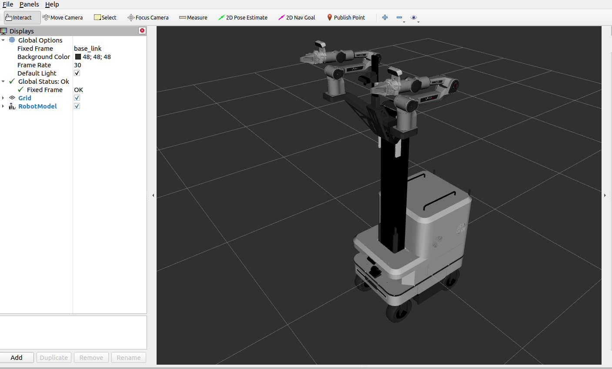

# split aloha 

## 使用环境

Ubuntu 20.04；ROS1 noetic

## 使用方法

创建工作空间

```
mkdir -p agilex_ws/src
cd agilex_ws/src
catkin_init_workspace
```

下载代码并编译

```
cd agilex_ws/src
git clone https://github.com/agilexrobotics/mobile_aloha_sim.git
cd agilex_ws/
catkin_make
```

查看模型

```
cd agilex_ws/
source devel/setup.bash
roslaunch split_aloha_mid_360 display_xacro.launch 
```




